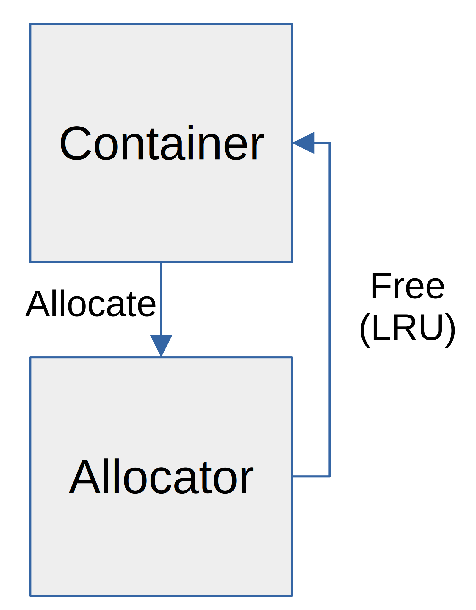

<!--
This presentation is written in markdown, and should be formatted using marp
-->

# Fun with C++ Allocators

---
<!-- These settings take effect for the remainder of the slides -->
<!-- header: '' -->
<!-- footer: 'C++ for Performance' -->
<!-- paginate: true -->

# The Problem I Needed to Solve

Result Set Caching
- How much space are we using

```c++
using resultBuffer_t = std::vector<uint8_t, xg::data::default_init_allocator<uint8_t>>;
using cacheResultData_t = std::vector<std::unique_ptr<resultBuffer_t>>;

struct cachedResult_t {
    time_t cmdTime;
    uuid::uuid_t queryId;
    cacheResultData_t rowBuffers;
    std::unordered_map<std::string, unsigned int> cols2Pos;
    std::unordered_map<std::string, std::string> cols2Types;
};
```

Vector of vectors and maps

---

# The Hard and Brittle Way

```c++
class resultCache_t {
    std::pair<size_t, size_t> purge(time_t cmdTime);
    void clear();
    void add(time_t cmdTime, const uuid::uuid_t &queryId, queryHash_t queryHash,
             cacheResultData_t &&data,
             ska::flat_hash_map<std::string, unsigned int> &&cols2Pos,
             ska::flat_hash_map<std::string, std::string> &&cols2Types);
```

Update each of those methods to calculate the amount of data added/removed and update perf counters

- create a `size()` method on `resultCache_t`

---

# The Hard and Brittle Way

Especially difficult because want to use 

```c++
cache.insert_or_assign(key, data);
```

Which will either add a new value to the cache, or replace the existing value.

---

# The "Elegant" Way: C++ Allocators

```c++
/**
 * This is an implementation of the C++ allocator that uses a perfCounter to
 * track the amount of memory currently allocated
 * 
 * T The type of the allocator....this is a requirement for allocators
 */
template <class T>
struct countedAllocator_t {
    using value_type = T;

    countedAllocator_t(perf::perfCounter_t* perfCounter);

    template <class U> countedAllocator_t(const countedAllocator_t<U>&);

    T* allocate(std::size_t n);

    void deallocate(T* p, std::size_t n);
};
```

---

# The "Elegant" Way: C++ Allocators

the `allocate()` and `deallocate` calls just call `std::allocator` and update a perf counter.

---

# Side Note: Forward Declaration

```c++
template <class T>
struct countedAllocator_t {
    using value_type = T;
    countedAllocator_t(perf::perfCounter_t* perfCounter);
    template <class U> countedAllocator_t(const countedAllocator_t<U>&);
    T* allocate(std::size_t n);
    void deallocate(T* p, std::size_t n);
};
```

This header file doesn't need the definition of perfCounter_t, it just uses a pointer so we can forward declare, and *not* include `perfCounter.h`

```
namespace perf {
class perfCounter_t;
}
```

---

# Side Note: Possible Cache Replacement



---

# Using the Allocator

```c++
using cacheBuffer_t = std::vector<uint8_t, perf::countedAllocator_t<uint8_t>>;
```

Note that the "type" of the vector and the type of the allocator have to match.

---

# Using the Allocator Part 2

I also wanted to track the metadata

```c++
std::unordered_map<std::string, unsigned int> cols2Pos;
std::unordered_map<std::string, std::string> cols2Types;
```

```c++
 std::unordered_map<std::string, unsigned int, 
                    std::hash<std::string>, 
                    std::equal_to<std::string>, 
                    perf::countedAllocator_t<std::pair<const cacheString_t, unsigned int>>> cols2Pos;

 std::unordered_map<std::string, std::string, 
                    std::hash<std::string>, 
                    std::equal_to<std::string>, 
                    perf::countedAllocator_t<std::pair<const cacheString_t, std::string>>> cols2Types;


```

C++ templates don't allow for "named" parameters

---

# Allocator Nesting

Lets say I have a container of containers

- std::vector<std::vector<int>>

Custom allocator version

- std::vector<std::vector<int, myAllocator_t>, myAllocator_t>

You would HOPE that the allocator gets passed from the outter container to the inner container

- e.g. if I construct the outer vector with a `countedAllocator_t` it would be used for the inner vectors
- Wishful thinking

---

# Allocator Nesting

The C++ standard contains a horrible thing called `std::scoped_allocator_adaptor`

```c++
template< class OuterAlloc, class... InnerAlloc >
class scoped_allocator_adaptor : public OuterAlloc;
```

The std::scoped_allocator_adaptor class template is an allocator which can be used with multilevel containers (vector of sets of lists of tuples of maps, etc). It is instantiated with one outer allocator type OuterAlloc and zero or more inner allocator types InnerAlloc.... A container constructed directly with a scoped_allocator_adaptor uses OuterAlloc to allocate its elements, but if an element is itself a container, it uses the first inner allocator. The elements of that container, if they are themselves containers, use the second inner allocator, etc. If there are more levels to the container than there are inner allocators, the last inner allocator is reused for all further nested containers.

---

# Allocator Nesting

In my use case, I *do* need to track the allocation of `std::string` along with their container

As with nested containers, if I have a:

```c++
// This is not valid, but for illustrative purposes...

std::vector<std::string<myAllocator>, myAllocator>
```

The instance of the allocator used in the vector does *not* get used to allocate the strings

And I think the ScopedAllocator only works for containers...

---

# And the Strings.....

When you allocate an object (e.g. a `std::string`) with a custom allocator you can EITHER:

- pass in the allocator as a parameter to the constructor
- have your custom allocator have a default (`my_allocator()`) constructor

Both of those are awkward in this case.  

- don't want `auto str = std::my_string("hello", my_allocator)`
- the intent is to have multiple perfcounters for different usecases

---

# And the Strings....

Solution, extend `countedAllocator_t` with a class that uses the right perfcounter

```c++
perf::perfCounter_t *metaDataAllocatorCounter();

template <class T>
class metaDataAllocator_t : public containers::countedAllocator_t<T> {
   public:
    metaDataAllocator_t() : containers::countedAllocator_t<T>(metaDataAllocatorCounter()) {}
    template <class U>
    metaDataAllocator_t(const metaDataAllocator_t<U> &) noexcept : 
       containers::countedAllocator_t<T>(metaDataAllocatorCounter()) {}
};

using cacheString_t = std::basic_string<char, std::char_traits<char>, metaDataAllocator_t<char>>;
```

---

# And the Strings.....

Guess how std::unordered_map is defined:

```c++
template<
    class Key,
    class T,
    class Hash = std::hash<Key>,
    class KeyEqual = std::equal_to<Key>,
    class Allocator = std::allocator< std::pair<const Key, T> >
> class unordered_map;
```

And any guesses whether `std::hash` and `std::equal_to` support strings with customer allocators?

---

# And the Strings.....


```c++
struct cacheStringHash_t {
    size_t operator()(const cacheString_t &str) const noexcept {
        std::string_view sv(str.data(), str.length());
        return std::hash<std::string_view>{}(sv);
    }
};

struct cacheStringEqual_t {
    bool operator()(const cacheString_t &a, const cacheString_t &b) const noexcept {
        std::string_view asv(a.data(), a.length());
        std::string_view bsv(b.data(), b.length());
        return std::equal_to{}(asv, bsv);
    }
};

std::unordered_map<cacheString_t, unsigned int, 
                   cacheStringHash_t, 
                   cacheStringEqual_t, 
                   metaDataAllocator_t<std::pair<const cacheString_t, unsigned int>>> cols2Pos;
```

---

# Allocators


---

# The C++ Standards Committee at Work


---

# C++20: Polymorphic Allocators

The intent is to solve *some* of the issues with traditional allocators

Without of course breaking any existing interfaces

---

# C++20: Polymorphic Allocators

1) create `std::pmr::polymorphic_allocator<T>`

2) The constructor can take a `memory_resource`

3) `memory_resource` is an abstract virtual class that implements

    - `do_allocate()`
    - `do_deallocate()`

4) Implement a bunch of standard things around `polymorphic_allocator`

---

# C++20: Polymorphic Allocators

Now provided by the standard library:

```c++
namespace pmr {

    template <class T>
    using vector = std::vector<T, std::pmr::polymorphic_allocator<T>>;

    template <class CharT, class Traits = std::char_traits<CharT>>
    using basic_string = std::basic_string< CharT, Traits,
                                            std::polymorphic_allocator<CharT>>

    using string = basic_string<char>
}
```

so now we have `std::pmr::vector<std::pmr::string>`

---

# Final ResultCache Implemenation

libxg/include/perf/perfMemoryResource.h

```c++
/**
 * A memory_resource that uses a perfcounter to track memory allocations
 * 
 * Use with std::polymorphic_allocator
 */
class perfMemoryResource_t : public std::experimental::pmr::memory_resource {
   public:
    perfMemoryResource_t(perf::perfCounter_t *counter);
    perfMemoryResource_t(const perfMemoryResource_t &) = default;

    void *do_allocate(size_t bytes, size_t alignment) override;
    void do_deallocate(void *ptr, size_t bytes, size_t alignment) override;
    bool do_is_equal(const std::experimental::pmr::memory_resource &other) const noexcept override;

   private:
    perf::perfCounter_t *m_counter;
    std::experimental::pmr::memory_resource *m_mr;
};
```

Note `experimental`

---

# Final ResultCache Implementation

libxg/src/perf/perfMemoryResource.cpp

```c++
perfMemoryResource_t::perfMemoryResource_t(perf::perfCounter_t *counter) : 
    m_counter(counter),                                                               
    m_mr(std::experimental::pmr::get_default_resource()) {}

void *perfMemoryResource_t::do_allocate(size_t bytes, size_t alignment) {
    m_counter->incrementValue(bytes);
    return m_mr->allocate(bytes, alignment);
}

void perfMemoryResource_t::do_deallocate(void *ptr, size_t bytes, size_t alignment) {
    m_counter->decrementValue(bytes);
    m_mr->deallocate(ptr, bytes, alignment);
}

bool perfMemoryResource_t::do_is_equal(const std::experimental::pmr::memory_resource &other) const noexcept {
    if (const auto *pm_other = dynamic_cast<const perfMemoryResource_t *>(&other)) {
        return m_counter == pm_other->m_counter;
    }
    return false;
}
```

---

# Final ResultCache Implementation

```c++
using cacheBuffer_t = std::experimental::pmr::vector<uint8_t>;
using cacheResultData_t = std::experimental::pmr::vector<std::unique_ptr<cacheBuffer_t>>;

using pmr_string = std::basic_string<char, std::char_traits<char>, std::experimental::pmr::polymorphic_allocator<char>>;

std::unique_ptr<cacheBuffer_t> makeCacheBuffer(const std::vector<uint8_t, xg::data::default_init_allocator<uint8_t>> &buffer);

struct cachedResult_t {

    ...    

    time_t cmdTime;
    uuid::uuid_t queryId;
    cacheResultData_t rowBuffers;
    std::experimental::pmr::unordered_map<pmr_string, unsigned int, stringHash_t, stringEqual_t> cols2Pos;
    std::experimental::pmr::unordered_map<pmr_string, pmr_string, stringHash_t, stringEqual_t> cols2Types;
};

```

gcc-8.2 doesn't have 

- `std::hash` etc for `std::pmr::string` yet
- `std::pmr::string`

---

# Final ResultCache Implementation

```c++
// Singleton to get a memory counter
class dataMemoryCounter_t {
   public:
    static std::experimental::pmr::memory_resource *getInstance() {
        static perf::perfMemoryResource_t pm(perf::perfRegistry_t::getCounter("resultCache.data",
                                                                              perf::perfCounterType_t::INSTANTANEOUS_VALUE,
                                                                              perf::perfCounterUnits_t::BYTES));
        return &pm;
    }
};
```
---


# Final ResultCache Implementation

Converting from the existing `std::vector` to our `std::pmr::vector`

```c++
std::unique_ptr<cacheBuffer_t> makeCacheBuffer(const std::vector<uint8_t, 
                                                                 xg::data::default_init_allocator<uint8_t>> &buffer) {
    auto cb = std::make_unique<cacheBuffer_t>(std::experimental::pmr::polymorphic_allocator<uint8_t>
                                              (dataMemoryCounter_t::getInstance()));
    cb->insert(cb->end(), buffer.begin(), buffer.end());
    return cb;
}
```

---

# Final ResultCache Implementation

Converting from the `ska::flat_hash_map` to our `std::pmr::unordered_map`

```c++
const ska::flat_hash_map<std::string, std::string> &_cols2Types;

cols2Pos(std::experimental::pmr::polymorphic_allocator<std::pair<pmr_string, unsigned int>>
                (metaDataMemoryCounter_t::getInstance()));

for (const auto &[k, v] : _cols2Pos) {
    cols2Pos[pmr_string(k, metaDataMemoryCounter_t::getInstance())] = v;
}

```

---

# Conclusion

`std::pmr::polymorphic_allocator` is a powerful tool

It gets a lot better with proper C++20 support

- gcc10

We should continue to explore uses for that pattern
 
