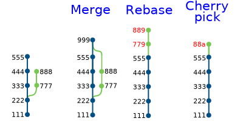
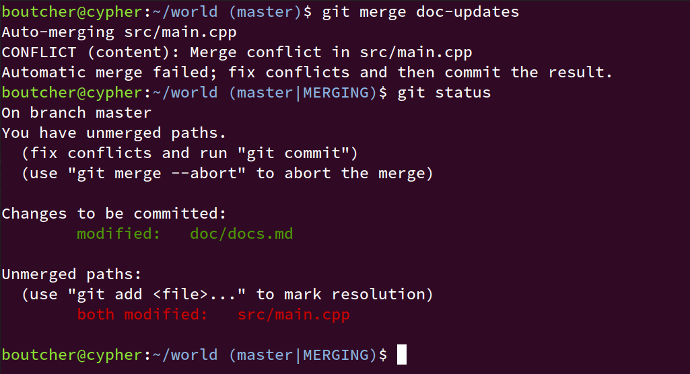
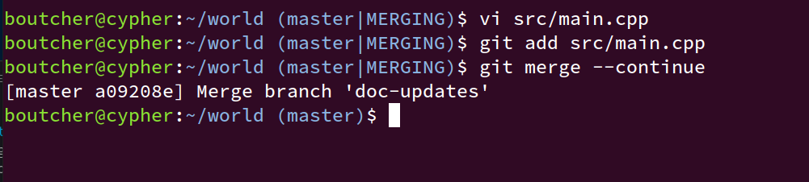

# advanced git

---
<!-- These settings take effect for the remainder of the slides -->
<!-- footer: 'advanced git' -->
<!-- paginate: true -->

# Deep git presentation


---

# what is git

- Distributed revision control system with an emphasis on being fast
- Every user has a full-fledged repository with complete history and full revision tracking
- Not dependent on network access or a central server.

---

# genesis

Written by Linus Torvalds for the Linux kernel

- Began development on 3 April 2005
- Announced the project on 6 April
- Became self-hosting on of 7 April
- First merge of multiple branches on 18 April
- Applied 6.7 patches per second on 29 April
- Managed the Linux kernel 2.6.12 release on 16 June

---

# example

I have a file called ```world/src/main.cpp``` that looks like this

```c++
#include <cstdio>

int main(int argc, char **argv) {
   printf("Hello world\n");
   return 0;
}
```

From the ~/world directory I do the following:

```console
$ git init
Initialized empty Git repository in /home/boutcher/world/.git/
(master)$ git add .
(master)$ git commit
```
---

# Showing git status in your prompt

***YOU REALLY SHOULD DO THIS***

```console

(db)$

```

---

# Entering a commit message 

Get an editor showing

```plain
First version
# Please enter the commit message for your changes. Lines starting
# with '#' will be ignored, and an empty message aborts the commit.
#
# On branch master
#
# Initial commit
#
# Changes to be committed:
#       new file:   src/main.cpp
#
```

***RTFM***

---

# Results of the first commit

```console
(master)$ git commit
[master (root-commit) 8102793] First version
 1 file changed, 7 insertions(+)
 create mode 100644 src/main.cpp
(master)$ 
```

---

# GUI vs command line

In this talk I will primarily be using the command line

There are GUI tools available for GIT

- Not as widely used as the command line
- Generally can’t do everything the command line can

---

# Git commands

Git commands are of the form “git foo”

- Note the space after git
- Help available from “git help foo”

In Linux, you can get help for commands by

- man git-foo
- See all the commands with “git help --all”

---

# Lets look at files in .git

```
.
├── branches
├── COMMIT_EDITMSG
├── config
├── description
├── HEAD
├── hooks
│   ├── applypatch-msg.sample
...
├── index
├── info
│   └── exclude
├── logs
│   ├── HEAD
│   └── refs
│       └── heads
│           └── master
├── objects
│   ├── 38
│   │   └── a88189a1b40f95c8c88a0268344ba8efe6942d
│   ├── 7e
│   │   └── d886cafdfd9a481009f91ae98373ff7c8238a9
│   ├── 81
│   │   └── 02793c106ae0d2adc1a69d513ff50a2d2cc95d
│   ├── 93
│   │   └── c2e2f6c0ea979ff62a96a2042ab6c0b00ed836
│   ├── f3
│   │   └── 1af2a2764d03ee743b3bf27e1397dc3617580f
│   ├── ff
│   │   └── 0c649cbb9fe0b1d3a192a1d0b3419d1bf0e96a
│   ├── info
│   └── pack
└── refs
    ├── heads
    │   └── master
    └── tags
```

---

# man gitrepository-layout

```plain
GITREPOSITORY-LAYOU(5)             Git Manual             GITREPOSITORY-LAYOU(5)

NAME
       gitrepository-layout - Git Repository Layout

SYNOPSIS
       $GIT_DIR/*

DESCRIPTION
       A Git repository comes in two different flavours:

       •   a .git directory at the root of the working tree;

       •   a <project>.git directory that is a bare repository (i.e. 
       without its own working tree), that is typically used for exchanging 
       histories with others by pushing into it and fetching from it.

       Note: Also you can have a plain text file .git at the root of your working 
       tree, containing gitdir: <path> to point at the real directory that has the 
       repository. This mechanism is often used for a working tree of a submodule 
       checkout, to allow you in the containing superproject to git checkout a 
       branch that does not have the submodule. The checkout has to remove the 
       entire submodule working tree, without losing the submodule repository.
```

---

# COMMIT_EDITMSG

```plain
First version
# Please enter the commit message for your changes. Lines starting
# with '#' will be ignored, and an empty message aborts the commit.
#
# On branch master
#
# Initial commit
#
# Changes to be committed:
#       new file:   src/main.cpp
#
```

---

# config

everything you specify with "git config" goes in this file

also includes remote repos (more later...)

```ini
[core]
        repositoryformatversion = 0
        filemode = true
        bare = false
        logallrefupdates = true
```

---

# description

```plain
Unnamed repository; edit this file 'description' to name the repository.
```

Only used by gitweb and email hooks

---

# HEAD

```plain
ref: refs/heads/master
```

---

# refs/heads/master

```plain
8102793c106ae0d2adc1a69d513ff50a2d2cc95d
```

```console
(master)$ git log
8102793c106ae0d2adc1a69d513ff50a2d2cc95d (HEAD -> master) First version
(master)$ git branch
* master
(master)$
```

---

# Digging deeper into the contents of HEAD

From man gitglossary"

```man
symref
      Symbolic reference: instead of containing the SHA-1 id itself, it is of
      the format ref: refs/some/thing and when referenced, it recursively
      dereferences to this reference.  HEAD is a prime example of a symref.
      Symbolic references are manipulated with the git-symbolic-ref(1)
      command.
```

---

# Objects

```console
(master)$ git log
8102793c106ae0d2adc1a69d513ff50a2d2cc95d (HEAD -> master) First version
$(master)
```

```plain
├── objects
│   ├── 38
│   │   └── a88189a1b40f95c8c88a0268344ba8efe6942d
│   ├── 7e
│   │   └── d886cafdfd9a481009f91ae98373ff7c8238a9
│   ├── 81
│   │   └── 02793c106ae0d2adc1a69d513ff50a2d2cc95d
│   ├── 93
│   │   └── c2e2f6c0ea979ff62a96a2042ab6c0b00ed836
│   ├── f3
│   │   └── 1af2a2764d03ee743b3bf27e1397dc3617580f
│   ├── ff
│   │   └── 0c649cbb9fe0b1d3a192a1d0b3419d1bf0e96a
```

---

# git commit sha

A 160 bit SHA-1 hash that uniquely identifies a commit, its contents and its parents in the universe

Cryptographically strong!

- originally developed to guarantee people couldn't slip malicious code into the Linux kernel

---

# Digging deeper

```console
(master)$ git cat-file -t 8102793c106ae0d2adc1a69d513ff50a2d2cc95d 
commit

(master)$ git cat-file -p 8102793c106ae0d2adc1a69d513ff50a2d2cc95d 
tree 93c2e2f6c0ea979ff62a96a2042ab6c0b00ed836
author Dave Boutcher <daveboutcher@gmail.com> 1589335022 -0500
committer Dave Boutcher <daveboutcher@gmail.com> 1589335022 -0500

First version

(master)$ git cat-file -p 93c2e2f6c0ea979ff62a96a2042ab6c0b00ed836
040000 tree 38a88189a1b40f95c8c88a0268344ba8efe6942d    src

(master)$ git cat-file -p 38a88189a1b40f95c8c88a0268344ba8efe6942d
100644 blob 7ed886cafdfd9a481009f91ae98373ff7c8238a9    main.cpp
```

---

# Digging even deeper

```console
(master)$ git cat-file -p 7ed886cafdfd9a481009f91ae98373ff7c8238a9 
#include <cstdio>

int main(int argc, char **argv) {
   printf("Hello world\n");
   return 0;
}

(master)$
```

---

# That's it

You have now seen all the magic behind git

---

# Adding some things

```console
(master)$ mkdir doc
(master)$ echo  'These are the docs' > doc/docs.md
(master)$ git add doc/docs.md 
(master)$ git status
On branch master
Changes to be committed:
  (use "git restore --staged <file>..." to unstage)
        new file:   doc/docs.md
(master)$
```

Now that change is "staged"

Staged changes are different than the "working tree"

---

# Committing staged files

```console
(master)$ git commit -m "add some docs"
[master 7266fa9] add some docs
 1 file changed, 1 insertion(+)
 create mode 100644 doc/docs.md
(master)$
```

---

# What is in our new commit?

```console
(master)$ git cat-file -p  7266fa9
tree 6bffc9d2d2095679b96c77bc7883d237fe9078c9
parent 8102793c106ae0d2adc1a69d513ff50a2d2cc95d
author Dave Boutcher <daveboutcher@gmail.com> 1589338420 -0500
committer Dave Boutcher <daveboutcher@gmail.com> 1589338420 -0500

add some docs:

(master)$ $ git cat-file -p 6bffc9d2d2095679b96c77bc7883d237fe9078c9
040000 tree eb919000277601ceda7d83ac945b888c85097461    doc
040000 tree 38a88189a1b40f95c8c88a0268344ba8efe6942d    src

(master)$
```

---

# Git is like blockchain

Each commit contains witin it the SHA of its parent(s), which contain their parents, to the beginning of time

You cannot change anything in the middle without changing everything downstream

---

# git diff is super clever

It knows the SHA of the ```src``` directory hasn't changed, so it doesn't have to consider it

---

# Branches

```console
(master)$ git checkout -b working
Switched to a new branch 'working'

(working)$ cat .git/HEAD 
ref: refs/heads/working

(working)$ tree .git/refs
.git/refs
├── heads
│   ├── master
│   └── working
└── tags

(working)$ cat .git/refs/heads/master
7266fa9152753d56fe340cb484a53366cba484c2

(working)$ cat .git/refs/heads/working
7266fa9152753d56fe340cb484a53366cba484c2
(working)$ 
```

---

# Git never deletes commit objects*

It's very hard to shoot yourself in the foot if you have committed a change

It can be hard to find that old commit though

git reflog will show you a history of changes

```console
(working)$ git reflog
7266fa9 (HEAD -> working, master) HEAD@{0}: checkout: moving from master to working
7266fa9 (HEAD -> working, master) HEAD@{1}: commit: add some docs:
8102793 HEAD@{2}: commit (initial): First version

(working)$
```

> *this is a lie

---

# My xgsrc reflog

```console
7fb3890e4f1 (HEAD -> db, xeograph/user/dboutcher/remove-r) HEAD@{0}: commit: Now actually remove R dependencies
7747c2607ff HEAD@{1}: commit: Remove R from toolchain
22696e566ff (xeograph/db#candidate-144442553) HEAD@{2}: pull: Fast-forward
bd2801d1ee5 (xeograph/db#candidate-142805950) HEAD@{3}: checkout: moving from user/dboutcher/rest_server to db
ff5f65d7e97 (xeograph/user/dboutcher/rest_server, user/dboutcher/rest_server) HEAD@{4}: reset: moving to HEAD
ff5f65d7e97 (xeograph/user/dboutcher/rest_server, user/dboutcher/rest_server) HEAD@{5}: rebase finished: returning to refs/heads/user/dboutcher/rest_server
ff5f65d7e97 (xeograph/user/dboutcher/rest_server, user/dboutcher/rest_server) HEAD@{6}: rebase: Update cpp-httplib version
dfcd51b61ce HEAD@{7}: rebase: checkout xeograph/user/dboutcher/rest_server
4fa54d9f518 HEAD@{8}: commit: Update cpp-httplib version
3f5af051661 HEAD@{9}: checkout: moving from db to user/dboutcher/rest_server
bd2801d1ee5 (xeograph/db#candidate-142805950) HEAD@{10}: checkout: moving from user/nkumar/perfV1-cleaned to db
d064ad1ea99 (xeograph/user/dboutcher/neil-buildinfo, user/nkumar/perfV1-cleaned) HEAD@{11}: commit (amend): Move build info functions out of buildInfo.h
7f3a69898a0 HEAD@{12}: commit: Move build info functions out of buildInfo.h
3ac9b4abad4 HEAD@{13}: checkout: moving from user/dboutcher/record-test-times to user/nkumar/perfV1-cleaned
9d1425c7928 (xeograph/user/dboutcher/record-test-times, user/dboutcher/record-test-times) HEAD@{14}: commit: Update job time recording after webui merge
34f510622e4 HEAD@{15}: commit (merge): Merge remote-tracking branch 'xeograph/db' into user/dboutcher/record-test-times
f1fd379ba02 HEAD@{16}: checkout: moving from db to user/dboutcher/record-test-times
bd2801d1ee5 (xeograph/db#candidate-142805950) HEAD@{17}: pull: Fast-forward
```

---

# Getting back where you were

```console
(master)$ git checkout -b oldstuff bd2801d1ee5 
Switched to a new branch 'oldstuff'
(oldstuff)$
```

```console
(master)$ git reset --hard bd2801d1ee5
HEAD is now at bd2801d1ee Merge pull request #10825 from Xeograph/user/adarre/db
(master)$
```

---

# Specifying revisions

HEAD

- Where-ever you currently are

Branch name

- E.g. master or working

HEAD^ or master^

- One change back

HEAD^^ or master^^

- Two changes back

etc

---

# Specifying revisions

HEAD~10 or master~10

- 10 changes back

HEAD@{yesterday}, @{two weeks ago}, @{date}

---

# Don't need to "switch to a branch" to look at it

(working)$ git log master

(working)$ git show master^


---

# git status

```console
$ git status
On branch working
Changes not staged for commit:
  (use "git add <file>..." to update what will be committed)
  (use "git restore <file>..." to discard changes in working directory)
        modified:   doc/docs.md

Untracked files:
  (use "git add <file>..." to include in what will be committed)
        .gitignore

no changes added to commit (use "git add" and/or "git commit -a")
 $
 ```

 ---

 # .gitignore files

Contains patterns (*.exe) of files for git to ignore

Typically you add “*.o” 


.can have multiple .gitignore in a repo in different directories
- Additive upward

---

# git log

```console
$ git log
commit 7266fa9152753d56fe340cb484a53366cba484c2 (HEAD -> working, master)
Author: Dave Boutcher <daveboutcher@gmail.com>
Date:   Tue May 12 21:53:40 2020 -0500

    add some docs:

commit 8102793c106ae0d2adc1a69d513ff50a2d2cc95d
Author: Dave Boutcher <daveboutcher@gmail.com>
Date:   Tue May 12 20:57:02 2020 -0500

    First version

$ git log --pretty=oneline
7266fa9152753d56fe340cb484a53366cba484c2 (HEAD -> working, master) add some docs
8102793c106ae0d2adc1a69d513ff50a2d2cc95d First version

$
```

---

# git config

Can change lots of defaults 

```console 
$ git config format.pretty oneline

$ git config user.name "Dave Boutcher"

$ git config user.email dboutcher@ocient.com

$
```

---

# the .git/config file now

```plain
[core]
        repositoryformatversion = 0
        filemode = true
        bare = false
        logallrefupdates = true
[format]
        pretty = oneline
[user]
        name = Dave Boutcher
        email = dboutcher@ocient.com
```

---

# git gc

Garbage collects

- this is the lie from a few slides ago

Periodically git find all objects in its tree that are now unreferenced

- no branch or tag points to them

Deletes orphaned objects

You can force this with ```git gc```

- ```git gc``` also packs objects into a more compact format
- better for moving across the network

---

# git gc

```console
$ git gc
Enumerating objects: 8, done.
Counting objects: 100% (8/8), done.
Delta compression using up to 4 threads
Compressing objects: 100% (4/4), done.
Writing objects: 100% (8/8), done.
Total 8 (delta 0), reused 0 (delta 0), pack-reused 0

$ $ tree .git/objects/
.git/objects/
├── db
│   └── 705edcb3c59a8eee030a36be048c28f767402f
├── info
│   ├── commit-graph
│   └── packs
└── pack
    ├── pack-975ec03bc7312bb77159f780fdb99e3f4b56ecb5.idx
    └── pack-975ec03bc7312bb77159f780fdb99e3f4b56ecb5.pack
```

---

# Making git forget

There is a big difference between these two

```console
0e428ba9aa86fd46d4c2c8a197ac176820f04e5e remove 200gb file I accidentally committed
b7630eb3673a4b758891cc3627f7de9386dd4407 make some changes
1ec2fbdb3a0c7af3accc98ea9dbd75a193a2bc35 good stuff
```

```console
0e428ba9aa86fd46d4c2c8a197ac176820f04e5e make some changes - fixed
1ec2fbdb3a0c7af3accc98ea9dbd75a193a2bc35 good stuff
```

*Note:* You almost never want to do ```git add .``` or ```git add -a```

---

# merge, rebase, and cherry-pick

Three ways to move changes between branches:

1. Merge: 
    Brings two parallel development streams together
2. Rebase: 
    Brings two parallel development streams together
3. Cherry pick
    Picks specific changes from one branch to another

---

# Bring to Branches Together



---

# git merge

```console
(master)$ git merge --no-ff doc-updates
Merge made by the 'recursive' strategy.
 doc/docs.md | 2 ++
 1 file changed, 2 insertions(+)
(master)$ git lg -n 10
*   04e7fc1 - (HEAD -> master) Merge branch 'doc-updates' (3 seconds ago) <Dave Boutcher>
|\  
| * 43db10a - (doc-updates) Make documentation more emphatic (54 minutes ago) <Dave Boutcher>
| * 57677b7 - Add more documentation (54 minutes ago) <Dave Boutcher>
* | 490b213 - Fix the text (55 minutes ago) <Dave Boutcher>
* | 2ba145e - Add more text (56 minutes ago) <Dave Boutcher>
* | 4306f59 - Add some comments to main (56 minutes ago) <Dave Boutcher>
|/  
* 31ce6c4 - add some docs (2 weeks ago) <Dave Boutcher>
* dc52375 - First version (2 weeks ago) <Dave Boutcher>
(master)$ 
```

---

# git merge 


---

# git merge

```console
(foo)$ git cat-file -p 0b27da1
tree c3c6db2a545ee155449f3ce7747a3826876db335
parent 490b213e2a672f2e254f41fc181bba5d84525263
parent 43db10a4b8536eaf8c832b924e01d8ccb0384994
author Dave Boutcher <daveboutcher@gmail.com> 1590523394 -0500
committer Dave Boutcher <daveboutcher@gmail.com> 1590523394 -0500

Merge branch 'doc-updates'
(foo)$
```

---

# git merge

You can actually merge multiple branches at once

- multiple parents
- up to 16

Don't actually do that unless you are insane

---

# fast forward merge

When a one of the branches is already a parent of the other

- i.e. no "fork"

---

# Undoing changes

git reset 

- ```--soft``` (the default) undoes a commit but leaves the changes in the working directory
- ```--hard``` removes the changes completely

```console
(master)$ git reset --hard HEAD^
HEAD is now at 490b213 Fix the text
(master)$ git lg
* 490b213 - (HEAD -> master) Fix the text (79 minutes ago) <Dave Boutcher>
* 2ba145e - Add more text (79 minutes ago) <Dave Boutcher>
* 4306f59 - Add some comments to main (80 minutes ago) <Dave Boutcher>
* 31ce6c4 - add some docs (2 weeks ago) <Dave Boutcher>
* dc52375 - First version (2 weeks ago) <Dave Boutcher>
(master)$
```

---

# Merge conflicts



---

# Merge conflicts

```diff
// This is the main function
#include <cstdio>

int main(int argc, char **argv) {
<<<<<<< HEAD
   printf("Hello larger world\n");
||||||| 31ce6c4
   printf("Hello world\n");
=======
   printf("goodbye world\n");
>>>>>>> doc-updates
   return 0;
}
```

---

# Fixing merge conflicts



---

# Rebasing

A rebase takes each change in turn from one branch and applies it on top of another

If at any point there is a conflict, you get the opportunity to fix it before moving on

```console
(doc-updates)$ git rebase master
Successfully rebased and updated refs/heads/doc-updates.
(doc-updates)$ git lg -n 10
* b246f21 - (HEAD -> doc-updates) Make documentation more emphatic (2 seconds ago) <Dave Boutcher>
* 68db22d - Add more documentation (2 seconds ago) <Dave Boutcher>
* 490b213 - (master) Fix the text (2 hours ago) <Dave Boutcher>
* 2ba145e - Add more text (2 hours ago) <Dave Boutcher>
* 4306f59 - Add some comments to main (2 hours ago) <Dave Boutcher>
* 31ce6c4 - add some docs (2 weeks ago) <Dave Boutcher>
* dc52375 - First version (2 weeks ago) <Dave Boutcher>
(doc-updates)$ 
```

---

# Golden rule of rebasing

***Never rebase of a branch that someone else is using!***

- the commit IDs change
- you will mess them up big time

***Do feel free to rebase your private work***

---

# Interactive rebase (```rebase -i```)

```console
(doc-updates)$ rebase -i master
```

```vi
pick 36fede8 Add more documentation                                                                                   . 
pick 1c3a141 Make documentation more emphatic

# Rebase 490b213..1c3a141 onto 490b213 (2 commands)
#
# Commands:
# p, pick <commit> = use commit
# r, reword <commit> = use commit, but edit the commit message
# e, edit <commit> = use commit, but stop for amending
# s, squash <commit> = use commit, but meld into previous commit
# f, fixup <commit> = like "squash", but discard this commit's log message
# x, exec <command> = run command (the rest of the line) using shell
# b, break = stop here (continue rebase later with 'git rebase --continue')
# d, drop <commit> = remove commit
# l, label <label> = label current HEAD with a name
# t, reset <label> = reset HEAD to a label
# m, merge [-C <commit> | -c <commit>] <label> [# <oneline>]
# .       create a merge commit using the original merge commit's
# .       message (or the oneline, if no original merge commit was
# .       specified). Use -c <commit> to reword the commit message.
#
# These lines can be re-ordered; they are executed from top to bottom.
#
# If you remove a line here THAT COMMIT WILL BE LOST.
#
# However, if you remove everything, the rebase will be aborted.
```

---

# git rebase -i

- ```git rebase -i HEAD~10```
- ```git rebase -i 36fede8```


---

# Cherry pick

Can always grab any commit

```console
(master)$ git cherry-pick doc-updates^
[master b8a9fbf] Add more documentation
 Date: Tue May 26 14:04:21 2020 -0500
 1 file changed, 2 insertions(+)
(master)$
```

Could also have done

```console
(master)$ git cherry-pick 36fede8 
```

---

# git revert

Creates an inverse patch

- this is a ***new*** commit that undoes a previous commit
- can revert multiple commits

---

# git stash

Saves away your work

```console
(master)$ git stash -m "main.cpp changes"
Saved working directory and index state On master: main.cpp changes
(master)$ git stash list
stash@{0}: On master: main.cpp changes
(master)$ git stash pop
On branch master
Changes not staged for commit:
  (use "git add <file>..." to update what will be committed)
  (use "git restore <file>..." to discard changes in working directory)
	modified:   src/main.cpp

no changes added to commit (use "git add" and/or "git commit -a")
Dropped refs/stash@{0} (207ed1805e83822ceb74a3f4400f73aa43283b47)
(master)$ 
```

Personally I always prefer to just "git commit -m "WIP"

---

# git add -i

Can selectively add changes to a commit

```console
(master)$ git add -i
           staged     unstaged path
  1:    unchanged        +1/-0 src/main.cpp

*** Commands ***
  1: status	  2: update	  3: revert	  4: add untracked
  5: patch	  6: diff	  7: quit	  8: help
What now> 

```

---

# git add -p

```console
 (master)$ git add -p
diff --git a/src/main.cpp b/src/main.cpp
index 36da4cc..9fbe249 100644
--- a/src/main.cpp
+++ b/src/main.cpp
@@ -1,4 +1,5 @@
 // This is the main function
+// more comments!
 #include <cstdio>
 
 int main(int argc, char **argv) {
(1/1) Stage this hunk [y,n,q,a,d,e,?]? ?
y - stage this hunk
n - do not stage this hunk
q - quit; do not stage this hunk or any of the remaining ones
a - stage this hunk and all later hunks in the file
d - do not stage this hunk or any of the later hunks in the file
e - manually edit the current hunk
? - print help
@@ -1,4 +1,5 @@
 // This is the main function
+// more comments!
 #include <cstdio>
 
 int main(int argc, char **argv) {
(1/1) Stage this hunk [y,n,q,a,d,e,?]?
```

---

# Manipulating files

- git mv
- git rm
- git add 

---

# Cleaning up your messy room

- git clean

---

# git blame

```
eae1e83ea35 (George Kondiles 2017-04-06 17:13:51 -0500 204)  * A utility class that allows for a replaceable 'reference' to a log sink
eae1e83ea35 (George Kondiles 2017-04-06 17:13:51 -0500 205)  */
eae1e83ea35 (George Kondiles 2017-04-06 17:13:51 -0500 206) template <typename TLOG>
eae1e83ea35 (George Kondiles 2017-04-06 17:13:51 -0500 207) class logSinkRef_t {
eae1e83ea35 (George Kondiles 2017-04-06 17:13:51 -0500 208)    public:
eae1e83ea35 (George Kondiles 2017-04-06 17:13:51 -0500 209)     logSinkRef_t() : m_ref(nullptr) {}
4378953f1c4 (Greg Murray     2018-06-28 18:16:50 +0000 210)     logSinkRef_t(TLOG &ref) : m_ref(&ref) {}
4378953f1c4 (Greg Murray     2018-06-28 18:16:50 +0000 211)     logSinkRef_t(TLOG *ref) : m_ref(ref) {}
eae1e83ea35 (George Kondiles 2017-04-06 17:13:51 -0500 212) 
4378953f1c4 (Greg Murray     2018-06-28 18:16:50 +0000 213)     void reset(TLOG &ref) { m_ref = &ref; }
4378953f1c4 (Greg Murray     2018-06-28 18:16:50 +0000 214)     void reset(TLOG *ref) { m_ref = ref; }
eae1e83ea35 (George Kondiles 2017-04-06 17:13:51 -0500 215) 
eae1e83ea35 (George Kondiles 2017-04-06 17:13:51 -0500 216)     /*!
eae1e83ea35 (George Kondiles 2017-04-06 17:13:51 -0500 217)      * Logs to this sink if the level is enabled.
eae1e83ea35 (George Kondiles 2017-04-06 17:13:51 -0500 218)      */
eae1e83ea35 (George Kondiles 2017-04-06 17:13:51 -0500 219)     template <typename... TLOGARGS>
4378953f1c4 (Greg Murray     2018-06-28 18:16:50 +0000 220)     void log(logLevel_t level, const_string format, TLOGARGS &&... args) {
26994e9f97b (Jason Arnold    2019-12-12 05:17:43 +0000 221)         if (!m_ref)
26994e9f97b (Jason Arnold    2019-12-12 05:17:43 +0000 222)             return;
347049c3224 (Tajesvi         2018-06-06 18:44:30 +0000 223) #pragma GCC diagnostic push
347049c3224 (Tajesvi         2018-06-06 18:44:30 +0000 224) #pragma GCC diagnostic ignored "-Wformat-security"
eae1e83ea35 (George Kondiles 2017-04-06 17:13:51 -0500 225)         m_ref->log(level, format, std::forward<TLOGARGS>(args)...);
347049c3224 (Tajesvi         2018-06-06 18:44:30 +0000 226) #pragma GCC diagnostic pop
eae1e83ea35 (George Kondiles 2017-04-06 17:13:51 -0500 227)     }
eae1e83ea35 (George Kondiles 2017-04-06 17:13:51 -0500 228) 
eae1e83ea35 (George Kondiles 2017-04-06 17:13:51 -0500 229)    private:
4378953f1c4 (Greg Murray     2018-06-28 18:16:50 +0000 230)     TLOG *m_ref;
eae1e83ea35 (George Kondiles 2017-04-06 17:13:51 -0500 231) };
eae1e83ea35 (George Kondiles 2017-04-06 17:13:51 -0500 232) 
480e0f24c23 (George Kondiles 2017-08-03 11:15:38 -0500 233) /*!
480e0f24c23 (George Kondiles 2017-08-03 11:15:38 -0500 234)  * The top-level log sink which is the parent of all sinks.
480e0f24c23 (George Kondiles 2017-08-03 11:15:38 -0500 235)  */
4378953f1c4 (Greg Murray     2018-06-28 18:16:50 +0000 236) logSink_t &LogSinkSingleton();
543b86281a1 (Dave Boutcher   2017-10-25 23:12:24 -0500 237) #define TOP_LEVEL_LOG_SINK LogSinkSingleton()
480e0f24c23 (George Kondiles 2017-08-03 11:15:38 -0500 238) 
```

---

# git bisect

Binary searches for a failure

```console
(db)$ git bisect start
(db|BISECTING)$ git bisect bad
(db|BISECTING)$ git bisect good HEAD~30
Bisecting: 60 revisions left to test after this (roughly 6 steps)
[efd76bebe1397e5bd12e34c37db3f2c7dbb02bc2] Update ocient-distcc-hosts
((efd76bebe1...)|BISECTING)$ git bisect good
Bisecting: 30 revisions left to test after this (roughly 5 steps)
[79f2706f9331c0bcf35ad60520be3b640696fa1f] Bump version file to 4.4.0
((79f2706f93...)|BISECTING)$ git bisect bad
Bisecting: 14 revisions left to test after this (roughly 4 steps)
[b8a3bbb8b26d533d4db2acb71fcdc0c28d775508] Bump version to 4.2.0
((b8a3bbb8b2...)|BISECTING)$ 
```

---

# fetching and pulling

```git fetch``` syncs up your repo with a remote repo *without updating any local branches*

```git pull``` combines fetch and merge and updates the current branch

---

# Comparing branches

git cherry compares commits in two branches by content, not sha

- if the same changes are in two branches *with different commit ids* they will not be shown

```console
(db)$ git cherry -v release/v4 db
+ 48c82696b920b07a21f08e4f240c856afe73f7e3 DB-9924: Add array constructors to the SQL grammar (#9616)
+ 6e14be71ed2f6181f48c06db2f2ffc9c35f586b7 tuple constructor syntax support (#9636)
+ 528ab498bcb426bb77d37a1bb6e65b72c97c810d DB-9925: Add tuple/array support for dataType.h/cpp (#9642)
+ acfcfb3f9a512ddf2751ef8ef4930de17dd0f2d0 DB-9926: Validation for array constructor (#9651)
+ 679b714598cd9909e4eded4079335d9cd4ccb65b creating arrayType with a limited set of functions (#9650)
+ 458e13c20be0c9568a8a7ad7a2e5ed331116a7b8 DB-9926: Array literal constructor functionality (#9681)
```

---

# Comparing branches

What files changed?

```console
(master)$ git diff --name-only master doc-updates
doc/docs.md
(master)$ 
```

---

# Comparing branches

What changed in one file?

```console
(master)$ git diff master doc-updates -- doc/docs.md
diff --git a/doc/docs.md b/doc/docs.md
index 9461938..9384d5b 100644
--- a/doc/docs.md
+++ b/doc/docs.md
@@ -1 +1,3 @@
 These are the docs
+
+I am making them even better
(master)$
```

---

# Closing tips

1. Commit early, commit often
1. Make backup branches before you do anything major!
1. Clean up your commits before you put on a “public” branch