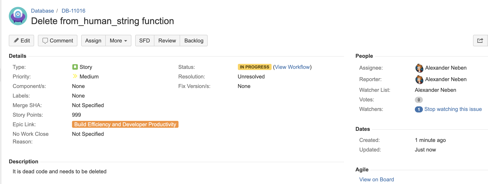

<!-- 
This presentation is written in markdown, and should be formatted using marp
-->

# Git at Ocient


---
<!-- These settings take effect for the remainder of the slides -->
<!-- header: '' -->
<!-- paginate: true -->
---

# Git Experience?
- Committing
- Branching
- Pushing/Pulling
- Forking
- Rebasing
- Cherry-picking
- Stashing
- Others...

---

# What is git?

A series of layered changes (these are called commits).

```diff
diff --git a/git/git.md b/git/git.md
new file mode 100644
index 0000000..70ae540
--- /dev/null
+++ b/git/git.md
@@ -0,0 +1,277 @@
+# What is git?
+
+A series of layered changes (these are called commits).
```


---

# Why use git?
- Alternatives?
- Standard
- Allows work in parallel
- Easy to isolate changes
- Any other reasons?

---

# Commits

Here is an example.

```diff
diff --git a/git/git.md b/git/git.md
index 739be4b..a998664 100644
--- a/git/git.md
+++ b/git/git.md
@@ -60,5 +60,21 @@ index 0000000..70ae540
+Here is an example.
```

---

# Commits

Here is a better example.

```diff
diff --git a/git/git.md b/git/git.md
index d20b691..c719bfd 100644
--- a/git/git.md
+++ b/git/git.md
@@ -60,7 +60,7 @@ index 0000000..70ae540
-Here is an example.
+Here is a better example.
```

---

# Commits

What happens when you apply both commits (in this order)?
```diff
diff --git a/git/git.md b/git/git.md
index 739be4b..a998664 100644
--- a/git/git.md
+++ b/git/git.md
@@ -60,5 +60,21 @@ index 0000000..70ae540
+Here is an example.
```

```diff
diff --git a/git/git.md b/git/git.md
index d20b691..c719bfd 100644
--- a/git/git.md
+++ b/git/git.md
@@ -60,7 +60,7 @@ index 0000000..70ae540
-Here is an example.
+Here is a better example.
```

---

# Branches

What is a branch?

---


---

# Merging


---

# Ocient's Setup

- Mostly a mono-repo (https://github.com/Xeograph/xgsrc)
- Smartptr-exercise (https://github.com/Xeograph/smartptr-exercise)
- xgpackaging (deployment) (https://github.com/Xeograph/xgpackaging)
- ocient.com (https://github.com/Xeograph/www_ocient_com)
- ocient_jdbc,OcientStreamClient,... (client libraries)
- packer-dev (devops)
- sales
- ...

---

# How to Write Code (Old Way)

- Commit
- Push to **fork**
- PR from **fork**

---

# How to Write Code

- Commit
- Push to upstream/origin (depending on your naming)
- PR from branch

---

# How to Write Code (Example)

https://jira.ocient.com:8443/browse/DB-11016



---

# How to Write Code (Example)

1.  ```sh
	git status
	On branch db
	nothing to commit, working directory clean
	```
2.  ```sh
	git checkout -b user/aneben/db-11016
	Switched to a new branch 'user/aneben/db-11016'
	```
3.  ```sh
	git status
	On branch user/aneben/db-11016
	nothing to commit, working directory clean
	```

---

# How to Write Code (Example)

From `libxg/include/util/stringutil.h`
```cpp
/**
 * Returns a long corresponding to the number represented by the input string.
 * So 1G (or 1g) returns 1024*1024*1024, and 1k (or 1K) returns 1024.
 * If the input is not in a recognized format, returns an empty optional.
 * @param s the string containing a representation of a number, optionally with G, M, or K
 * @return an option containing the number in the input as a long, or nothing if the string is not
 * a recognizable number.
 */
inline std::optional<long> from_human_string(const std::string& s) {
    const static std::vector<std::pair<std::regex, long>> REGEXES{
        {std::regex("^([0-9]+)$", std::regex::icase), 1},
        {std::regex("^([0-9]+)k(i?b)?$", std::regex::icase), 1024L},
        {std::regex("^([0-9]+)m(i?b)?$", std::regex::icase), 1024L * 1024L},
        {std::regex("^([0-9]+)g(i?b)?$", std::regex::icase), 1024L * 1024L * 1024L}};
    static_assert(sizeof(long) == sizeof(int64_t));
    for (auto it = REGEXES.cbegin(); it != REGEXES.cend(); it++) {
        auto& re = it->first;
        auto factor = it->second;
        std::smatch match;
        if (std::regex_match(s, match, re)) {
            long number = std::stol(match[1]);
            return factor * number;
        }
    }
    return {};
}
```

---

# How to Write Code (Example)
```diff
diff --git a/libxg/include/util/stringutil.h b/libxg/include/util/stringutil.h
index dda1ed0..d1c91ae 100644
--- a/libxg/include/util/stringutil.h
+++ b/libxg/include/util/stringutil.h
@@ -86,33 +86,6 @@ inline std::string to_human_string(long val) {
-/**
- * Returns a long corresponding to the number represented by the input string.
- * So 1G (or 1g) returns 1024*1024*1024, and 1k (or 1K) returns 1024.
- * If the input is not in a recognized format, returns an empty optional.
- * @param s the string containing a representation of a number, optionally with G, M, or K
- * @return an option containing the number in the input as a long, or nothing if the string is not
- * a recognizable number.
- */
-inline std::optional<long> from_human_string(const std::string& s) {
-    const static std::vector<std::pair<std::regex, long>> REGEXES{
-        {std::regex("^([0-9]+)$", std::regex::icase), 1},
-        {std::regex("^([0-9]+)k(i?b)?$", std::regex::icase), 1024L},
-        {std::regex("^([0-9]+)m(i?b)?$", std::regex::icase), 1024L * 1024L},
-        {std::regex("^([0-9]+)g(i?b)?$", std::regex::icase), 1024L * 1024L * 1024L}};
-    static_assert(sizeof(long) == sizeof(int64_t));
-    for (auto it = REGEXES.cbegin(); it != REGEXES.cend(); it++) {
-        auto& re = it->first;
-        auto factor = it->second;
-        std::smatch match;
-        if (std::regex_match(s, match, re)) {
-            long number = std::stol(match[1]);
-            return factor * number;
-        }
-    }
-    return {};
-}
-
```

---

# How to Write Code (Example)
1.  ```sh
	git status
	On branch user/aneben/db-11016
	Changes not staged for commit:
  	  (use "git add <file>..." to update what will be committed)
      (use "git checkout -- <file>..." to discard changes in working directory)

         modified:   libxg/include/util/stringutil.h

    no changes added to commit (use "git add" and/or "git commit -a")
	```
2.  ```sh
	git add libxg/include/util/stringutil.h
	```

---

# How to Write Code (Example)

3.  ```sh
	git status
	On branch user/aneben/db-11016
	Changes to be committed:
	  (use "git reset HEAD <file>..." to unstage)

	    modified:   libxg/include/util/stringutil.h
	```
4.  ```sh
	git commit -m "[DB-11016] Deleted dead to_human_string() function"
	The staged content is formatted correctly.
	[user/aneben/db-11016 a17f571] [DB-11016] Deleted dead to_human_string() function
	 1 file changed, 27 deletions(-)
	```
**Notice**: I included the ticket number.
**Notice**: The commit message is understandable and represents the changes made.
**Notice**: More specifics can be found [here](https://confluence.ocient.com:8443/display/designs/Git+Usage+Guidelines)
  
---

# How to Write Code (Example)

5.  ```sh
	git push upstream user/aneben/db-11016
	Counting objects: 21, done.
	Delta compression using up to 72 threads.
	Compressing objects: 100% (19/19), done.
	Writing objects: 100% (21/21), 2.74 KiB | 0 bytes/s, done.
	Total 21 (delta 16), reused 6 (delta 2)
	remote: Resolving deltas: 100% (16/16), completed with 14 local objects.
	remote:
	remote: Create a pull request for 'user/aneben/db-11016' on GitHub by visiting:
	remote:      https://github.com/Xeograph/xgsrc/pull/new/user/aneben/db-11016
	remote:
	To git@github.com:Xeograph/xgsrc.git
     * [new branch]      user/aneben/db-11016 -> user/aneben/db-11016
	```
https://github.com/Xeograph/xgsrc/pull/10943

---

# How to Write Code (Example)

- Pull approve
- CI

---

# Git DOs and DONTs

- **DO:** Include ticket number and make commit messages descriptive
- **DO:** Keep PRs small (avoid scope creep) (review time is O(n^2))
- **DO:** Squash merge
- **DO:** Include tests in PRs
- **DONT:** Address comments commit [example](https://github.com/Xeograph/xgsrc/search?q=addressed+comments&type=Commits)
- **DONT:** Swear in commit messages [example](https://github.com/Xeograph/xgsrc/commit/292fd9b9fc3974ded4c815b8f74b332f9967abca)

---

# Git Branch Structure

- **user/<name>/<whatever>:** small fixes (default)
- **feature/<feature-name>:** larger feature projects
- **release/v<x>:** release for customers (have been very well tested)
- **staging/<name>/<whatever>:** branches created by CI
- **db:** where most active development happens

---

# Git Cheat Sheet (basics)

- `git commit -m "<commit-message>"` - create a commit op the active branch
- `git status` - show useful information
- `git checkout [-b|] <branch-name>` - checkout / checkout and create a branch
- `git branch` - list all branches
- `git log` - show all commits on branch

---

# Git Cheat Sheet (basics)

- `git pull [upstream|origin] <branch-name>` - get all commits from remote to local copy
- `git push [upstream|origin] <branch-name>` - push all commits from local to remote
- `git diff [lhs] [rhs]` - diff of two commits both sides have defaults
- `git fetch [upstream|origin]` - fetch all commits and branches from a remote
- `git stash` - save all "added" non-committed changes on a stack
- `git stash pop` - delete and apply the most recent set stashed changes

---

# Git Cheat Sheet (advanced)

- `git rebase -i`* - Rewrite history to squash and change commits (powerful command)
- `git cherry-pick <commit-sha>` - Apply a commit ontop of current commit
- `git reset --hard`* - delete all non-committed changes
- `git remote -v` - display all remotes (verbose)
- `git push ... --force`* - push to a remote overwriting commits
**IMPORTANT: Items marked with `*` can cause written code to be unrecoverable**

---

# Additional Resources
1. https://confluence.ocient.com:8443/display/devops/Git+Guide+for+Multi-Person+Projects
2. https://confluence.ocient.com:8443/display/designs/Git+Usage+Guidelines
3. https://www.atlassian.com/git/tutorials
4. Other engineers. (Git is widely used. Do you best to google an answer before asking)