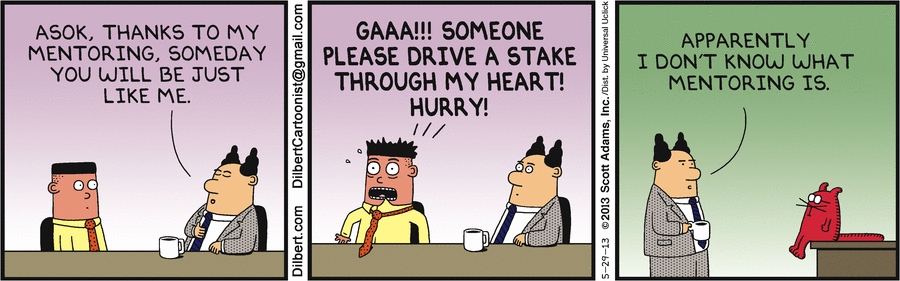
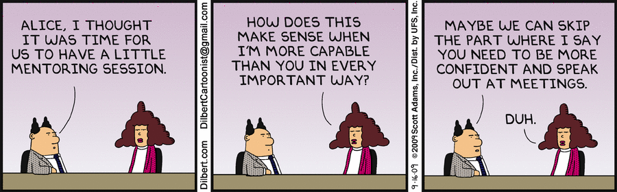

<!--
This presentation is written in markdown, and should be formatted using marp
-->

# Developing a Mentoring Culture

When Ocient does an "engagement survey" it would be great if people said:

**"One of the things I love about Ocient is the culture of mentoring"**

---
<!-- These settings take effect for the remainder of the slides -->
<!-- header: '' -->
<!-- footer: 'Mentoring' -->
<!-- paginate: true -->

# Mentoring Relationships Should Happen Organically

Good mentoring relationships last beyond a single job

---

---

# Should Work in Good Times and Bad Times

- In good times, help you be better
- In bad times, help you survive and thrive

---

# A Mentor is Different than a Technical Expert

We do a good job of having domain experts share knowledge

We want to do a better job of having career resources

---

# Non-exhaustive List of Things to Talk to a Mentor About

- What is the best way to move to a new project?
- I'm not having fun in my job any more.
- How can I grow my skills in some area?
- I am struggling with work/life balance
- I think Ocient should do something different? How do I bring that up
- How do I translate the "Tech Ladder" confluence page into actions

---

# Mentoring Requires Effort on Both Sides

- scheduling meetings and reaching out
- being honest
- establishing trust

---

# Not Everyone Wants or Needs a Mentor

---

# Finding a Mentor

It is **your** job to find a mentor

- but your peers, your manager, HR can help

It has to be someone **you** are comfortable with

---

# Finding a Mentor

The approach is very much whatever you feel comfortable with:

- [Mentoring on Confluence](https://ocient.atlassian.net/wiki/spaces/devops/pages/3038478557/Mentoring)

    - The person may decline if they are already overloaded

- Talk to your manager

- Talk to Tanner

Doesn't have to start with "Will you be my mentor".  It can be "Can we have a chat?'

---

# Why Have a Mentor?

When you are frustrated, don't just "shout it into the void"

It should not just be "Wisdom being passed down", it should be a chance to exchange perspectives and ideas

But each relationship is unique
