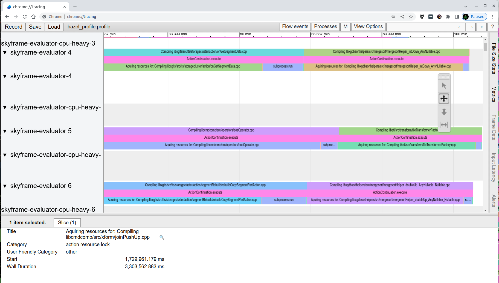
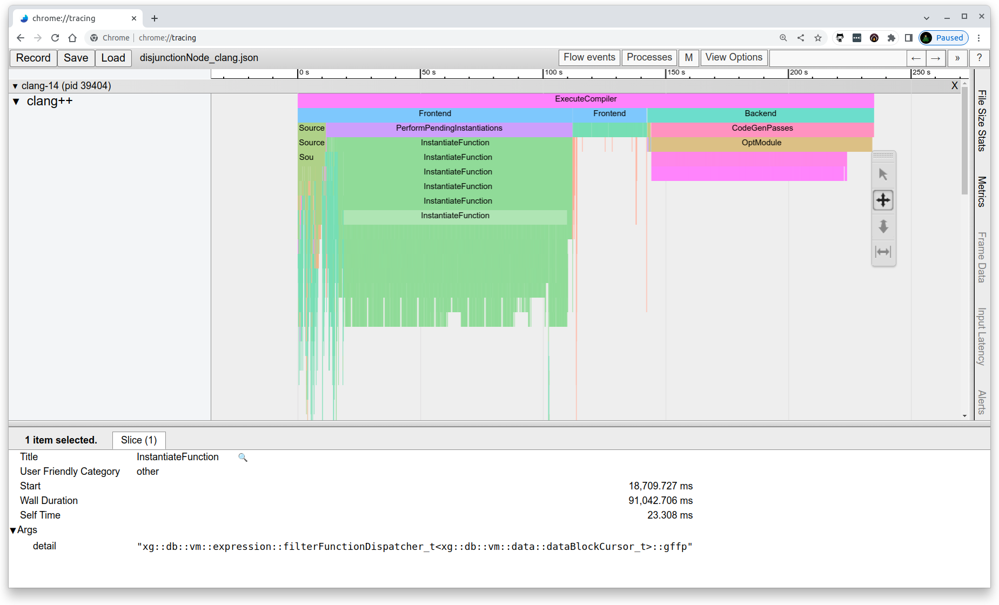

<!--
This presentation is written in markdown, and should be formatted using marp
-->

# Type Erasing and Writing Simpler Code

## The Goal: Faster Compile Times

---
<!-- These settings take effect for the remainder of the slides -->
<!-- header: '' -->
<!-- footer: 'Type Erasure' -->
<!-- paginate: true -->

# Motivation

```
Compiling libxgdbdata/src/data/disjunctionNode8.cpp; 753s processwrapper-sandbox
Compiling libxgdbdata/src/data/disjunctionNode9.cpp; 744s processwrapper-sandbox
Compiling libxgdbdata/src/data/disjunctionNode3.cpp; 744s processwrapper-sandbox
Compiling libxgdbdata/src/data/disjunctionNode7.cpp; 744s processwrapper-sandbox
Compiling libxgdbdata/src/data/disjunctionNode4.cpp; 743s processwrapper-sandbox
```

---

Framed on the Ocient office wall...


---

# Things to Consider

1) Compile times themselves

2) How many files need to be recompiled for a given change

---

# Digging Into Build Performance

Bazel compiles produces `/tmp/bazel_profile.profile`

.bazelrc contains:

```
# Time each command and record actions that were run
build --profile /tmp/bazel_profile.profile
```

You can override on the command line with `--profile=my_favorite_file`

---

# bazel_profile.profile

```json
{
  "otherData": {
    "build_id": "870d0bf8-1da9-4e2d-a6c7-9403a9072802",
    "output_base": "/home/boutcher/.cache/bazel/_bazel_boutcher/712818b7f990818778af151303e91223",
    "date": "Tue Jan 10 08:52:47 COT 2023"
  },
  ...
      {
      "cat": "action processing",
      "name": "Compiling libxgdbdata/src/data/disjunctionNode.cpp",
      "ph": "X",
      "ts": 3926634,
      "dur": 76181974,
      "pid": 1,
      "tid": 6689
    },
```

I did everything with `--config=local`.  

Tools Team could do a tech talk on cool Bazel tricks :-)

---



---

# `jq` To The Rescue

```
jq '.traceEvents | sort_by(.dur)[] | select(.name|test("Compiling.")) | "\(.dur/1000000) \(.name)"'  
```

```
...
"3857.80557 Compiling libcmdcomp/src/premadeplans/gatherLimitPlan.cpp"
"3867.677358 Compiling libcmdcomp/src/parser/tktValidator.cpp"
"3876.170835 Compiling libcmdcomp/src/premadeplans/unionAllPlan.cpp"
"3876.636828 Compiling libcmdcomp/src/premadeplans/xformTestPlansJoin.cpp"
"3912.318463 Compiling libcmdcomp/src/premadeplans/xformTestPlansMisc.cpp"
"4392.334387 Compiling libxglts/src/lts/storagecluster/storageClusterProtocolInstance.cpp"
"4392.342594 action 'Compiling libxglts/src/lts/storagecluster/storageClusterProtocolInstance.cpp'"
```

(note: why are we incouding premade plans in `rolehostd`....) :shrug:

---

# -ftime_report

Dave's hacky way of doing things:

```
bazel build -s --sandbox_debug rolehostd
```

Copy the output to a shell script and edit

```
#!/bin/bash

(cd /home/boutcher/.cache/bazel/_bazel_boutcher/712818b7f990818778af151303e91223/execroot/xgsrc && \
  exec env - \
    LD_LIBRARY_PATH=/ocient/toolchain/v2.2.3/lib:/ocient/toolchain/v2.2.3/lib64 \
    PATH=/ocient/toolchain/v2.2.3/rvm/gems/ruby-2.7.0/bin:... \
    PWD=/proc/self/cwd \
  /ocient/toolchain/v2.2.3/bin/g++ -MD -MF /tmp/disjunctionNode.d '-frandom-seed=bazel-out/k8-dbg/bin/libxgdbdata/_objs/xgdbdata_shared/disjunctionNode.o' -iquote . ...
```

Edit the options, play with the artifacts

---

# ftime_report

```
Time variable                                   usr           sys          wall               GGC
 phase setup                        :   0.01 (  0%)   0.00 (  0%)   0.02 (  0%)    1774 kB (  0%)
 phase parsing                      :  19.49 (  8%)   9.39 ( 23%)  28.91 ( 10%) 1386917 kB ( 11%)
 phase lang. deferred               :  54.54 ( 23%)  13.61 ( 34%)  68.16 ( 25%) 2906016 kB ( 23%)
 phase opt and generate             : 155.88 ( 66%)  17.10 ( 43%) 173.00 ( 63%) 8347713 kB ( 65%)
 phase last asm                     :   5.31 (  2%)   0.13 (  0%)   6.07 (  2%)  109314 kB (  1%)
 phase finalize                     :   0.01 (  0%)   0.00 (  0%)   0.00 (  0%)       0 kB (  0%)
 |name lookup                       :   7.81 (  3%)   2.35 (  6%)   9.19 (  3%)  127278 kB (  1%)
 |overload resolution               :  26.92 ( 11%)   8.00 ( 20%)  34.80 ( 13%) 1573571 kB ( 12%)
...
 parser inl. func. body             :   2.20 (  1%)   0.83 (  2%)   2.99 (  1%)  112931 kB (  1%)
 parser inl. meth. body             :   2.54 (  1%)   0.82 (  2%)   3.50 (  1%)  144378 kB (  1%)
 template instantiation             :  50.10 ( 21%)  13.37 ( 33%)  62.94 ( 23%) 3107540 kB ( 24%)
 constant expression evaluation     :   5.42 (  2%)   1.94 (  5%)   7.79 (  3%)   77543 kB (  1%)
 constraint normalization           :   0.03 (  0%)   0.00 (  0%)   0.03 (  0%)    2953 kB (  0%)
 ...
 unaccounted post reload            :   0.01 (  0%)   0.00 (  0%)   0.04 (  0%)       0 kB (  0%)
 unaccounted late compilation       :   0.02 (  0%)   0.02 (  0%)   0.05 (  0%)       0 kB (  0%)
 repair loop structures             :   0.20 (  0%)   0.03 (  0%)   0.24 (  0%)       0 kB (  0%)
 TOTAL                              : 235.24         40.23        276.16       12751748 kB
```

---

# clang -ftime-trace

Our code kind of compiles with clang:

```
bazel build rolehostd --//toolchain.v2:compiler=clang
```

Adding `-ftime-trace` Produces json that can also be loaded in to chrome

(Note to self #5534: make the code compile with clang)

---



---

# What I ACTUALLY want to talk about

Reducing header file dependencies in our code

*”Dependency is the key problem in software development at all scales.”*
(Kent Beck, TDD by Example)

---

# Reducing dependencies

There will always be dependencies

We want to avoid *artificial* dependencies

*"The goal of software architecture is to minimize the human resources required to build and maintain the required system"*
Robert Martin

---

# Dependency files

One of the OTHER outputs of our compilation process is the dependency files:

`disjunctionNode.d`

```
/tmp/disjunctionNode.o: libxgdbdata/src/data/disjunctionNode.cpp \
 /usr/include/stdc-predef.h \
 libxgdbdata/include/expression/disjunctionNode.imp.h \
 libxgdbdata/include/expression/disjunctionNode.h \
 bazel-out/k8-dbg/bin/libxg/_virtual_includes/xg/data/sqlTypeDefinitions.h \
 bazel-out/k8-dbg/bin/libxg/_virtual_includes/xg/xg.h \
 /ocient/toolchain/v2.2.3/include/c++/10.3.0/atomic \
 /ocient/toolchain/v2.2.3/include/c++/10.3.0/bits/atomic_base.h \
 /ocient/toolchain/v2.2.3/include/c++/10.3.0/x86_64-pc-linux-gnu/bits/c++config.h \
 /ocient/toolchain/v2.2.3/include/c++/10.3.0/x86_64-pc-linux-gnu/bits/os_defines.h \
 /usr/include/features.h /usr/include/x86_64-linux-gnu/sys/cdefs.h \
 /usr/include/x86_64-linux-gnu/bits/wordsize.h \
 /usr/include/x86_64-linux-gnu/gnu/stubs.h \
 /usr/include/x86_64-linux-gnu/gnu/stubs-64.h \
 /ocient/toolchain/v2.2.3/include/c++/10.3.0/x86_64-pc-linux-gnu/bits/cpu_defines.h \
 /ocient/toolchain/v2.2.3/include/c++/10.3.0/pstl/pstl_config.h \
 ...
```

---

# disjunctionNode

`disjunctionNode.cpp`

```
#include "expression/disjunctionNode.imp.h"
#include "data/dataBlock.h"
```

`disjunctionNode.impl.h`

```
#include "expression/disjunctionNode.h"
#include "xgdb.h"
#include "sqlStates.h"
#include "expression/exprTypes.h"
```

Seems innocent enough

---

# disjunctionNode

The above files actually pull in 1,402 include files

Includes gems like `etConfigReqRes.pb.h`

---

# Forward Declarations

Greatly reduce the need for transitive header files

Can only be used in places where you don't care about things like size

In my opinion, Ocient doesn't use them enough....

---

# Classic Forward Declaration Example

## `myThing.h`

```c++
class MyComplicatedThing; // Forward declare

class MyThing {
    MyComplicatedThing *makeThing();
    bool useThing(MyComplicatedThing *thing);
};
```

**No user of the header file ever cares about the internals of `MyComplicatedThing`**

---

# Classic Forward Declaration Example

## `myThing.cpp`

```c++
// This has 100 transitive includes
#include "myComplicatedThingDeclaration.h"

MyComplicatedThing MyThing::makeThing() {
    return new MyComplicatedThing();
}

bool MyThing::useThing(MyComplicaedThing *thing) {
    return thing->doSomething();
}
```

---

# Forward Declarations and Data Members

This doesn't work:

```c++
class Duck;

class FooDuck {
  public:
    void quack();
  private:
    Duck m_duck;
};
```

```c++
#include "fooduck.h"
int main(int argc, char **argv) {
    FooDuck fd;
    fd.quack();
    return 0;
}
```

---

```c++
class Duck;

class FooDuck {
  public:
    void quack();
  private:
    Duck m_duck;
};

int main(int argc, char **argv) {
    FooDuck fd;
    fd.quack();
    return 0;
}
```

```
test1.cpp:7:10: error: field has incomplete type 'Duck'
    Duck m_duck;
         ^
test1.cpp:1:7: note: forward declaration of 'Duck'
class Duck;
      ^
1 error generated.
```

---

# Forward Declarations and Data Members

This works

```c++
class Duck;

class FooDuck {
  public:
    FooDuck();
    void quack();
  private:
    Duck *m_duck;
};

int main(int argc, char **argv) {
    FooDuck fd;
    fd.quack();
    return 0;
}
```

---

# Forward Declarations and References

This works in a header file

`myheader.h`

```c++
class Duck;

bool rockTheDuck(Duck &duck);

```

---

# Forward Declarations and References

This works in a cpp file

```c++
#include "myheader.h"

void myFunction(Duck &duck) {
    // do stuff
    rockTheDuck(duck);
    // do some more stuff
}

```

As long as you never care about the *contents* of the forward declared object

---

# Returning by reference

This even works:

```c++
class Foo;

Foo &getAFoo();

Foo &myFunction() {
    return getAFoo();
}
```

---

# Forward Declarations and Smart Pointers

We would never use naked pointers, of course

```c++
#include <memory>
class Duck;

class FooDuck {
  public:
    FooDuck();
    void quack();
  private:
    std::unique_ptr<Duck> m_duck;
};
```

---

# Forward Declarations and Smart Pointers

```
In file included from test1.cpp:1:
In file included from ./fooduck.h:1:
In file included from memory:682:
In file included from shared_ptr.h:25:
unique_ptr.h:53:19: error: invalid application of 'sizeof' to an incomplete type 'Duck'
    static_assert(sizeof(_Tp) > 0,
                  ^~~~~~~~~~~
unique_ptr.h:318:7: note: in instantiation of member function 'std::default_delete<Duck>::operator()' requested here
      __ptr_.second()(__tmp);
      ^
unique_ptr.h:272:19: note: in instantiation of member function 'std::unique_ptr<Duck>::reset' requested here
  ~unique_ptr() { reset(); }
                  ^
./fooduck.h:4:7: note: in instantiation of member function 'std::unique_ptr<Duck>::~unique_ptr' requested here
class FooDuck {
      ^
./fooduck.h:2:7: note: forward declaration of 'Duck'
class Duck;
      ^
1 error generated.
```

---

# Forward Declarations and Smart Pointers

Make sure you declare a destructor...

```c++
#include <memory>
class Duck;

class FooDuck {
  public:
    FooDuck();
    ~FooDuck();   // <========>
    void quack();
  private:
    std::unique_ptr<Duck> m_duck;
};
```

---

# Forward Declarations and Smart Pointers

```c++
#include "duck.h"

FooDuck::FooDuck() { m_duck = std::make_unique<Duck>(); }
FooDuck::~FooDuck() = default;
```

---

# Forward Declarations and Namespaces

The syntax for nested namespaces is ugly...thank you C++ committee

```
namespace xg::md {
    class systemElement;
}
```

---

# Forward Declarations and Templates

```c++
template <typename T>
class Foo;

Foo<int> &something();

Foo<int> myFunc() {
        return something();
}
```

---

# Forward Declarations and Enums

You can **only** forward declare `enum class`

```c++
enum Foo1;        // this will fail, size unknown
enum class Foo2;  // This will work
enum class Foo3: char; // this will work
```

---

# OK, why are we talking about this

We don't want to go full PIMPL...

---

# PIMPL

An ugly pattern in my opinion that solves the same problem

```c++
class User {
public:
    User(string name);
    ~User();
 
    User(const User& other);
    User& operator=(User rhs);
 
    // Getter
    int getSalary();
 
    // Setter
    void setSalary(int);
 
private:
    // Internal implementation class
    class Impl;
 
    // Pointer to the internal implementation
    std::unique_ptr<Impl> pimpl;
};
```

---

# PIMPL C++ file

```c++
// First define the implementation class
class User::Impl {
  public:
    Impl() { ... }
    ~Impl() { ... }
    int getSalary() { ... }
    void setSalary(int s) { ... }
};

// Then forward all the methods to the implementation
int User::getSalary() { 
    return pimpl->getSalary();
}
```

---

# We Should be Smart About Dependencies

Our code base is only going to keep growing

Our dev team is only going to keep growing

Use Forward Declarations appropriately

- Particularly for protobuf messages that should rarely be copied anyways

---

# The Reality However

I started to look at `sqlTypes.h`

- Used a LOT
- Drags in a lot of protobuf and other header files

Has some lovely function declarations like:

```c++
/*!
 * Converts metadata to a string
 */
std::string metadataToString(const xg::md::columnMetadata& colMetadata);
```

I was excited

---

# However

```c++
// return a fully defined  copy :-() 
xg::md::columnMetadata innerMostColumnMd(const xg::md::columnMetadata& arrayColMd);
```

---

# However

```c++
// Return a defined type in a std::optional
std::optional<xg::md::column> getTupleNullFlagCol(const xg::md::columnMetadata& tupleColMetaData);
```

---

# However

```c++
// Use the type inline
inline std::string getInternalString(const xg::md::columnMetadata& colMetadata) {
 const auto prop = xg::data::sqlFieldProperties_t::getProp(colMetadata.derived_type());
 assert(prop);
 if (colMetadata.derived_type() == xg::md::dbDerivedColumnType::DERIVED_FIXED_BINARY) {
  return prop->internalTypePrefix + std::to_string(colMetadata.basis_x_bytes_md().x());

```

---

# I was sad


---

# Conclusions

There are pros and cons to forward declarations.

Pros:

- Forces cleaner header files and interfaces between components
- Reduces compile times
- Reduces the *number* of files recompiled

Cons:

- C++ sucks  
  - If you have a stale forward declaration you will never notice
  - If a change is made to later include the header, you will never notice

---

# Conclusions

Include What you Use will recommend forward declarations

Google Style Guide recommends *against* using forward declarations.

---

# Conclusions

General wisdom is *against* creating forward-only header files

- e.g. `myfunc_fwd.h` that matches `myfunc.h`

The STL actually contains *ONE* of file that forward declares iostreamand friends:

- `<iosfwd>`

---

# Conclusions

All of this may be irrelevant when
a) C++ modules support is delivered
b) Ocient switches to using C++ modules

